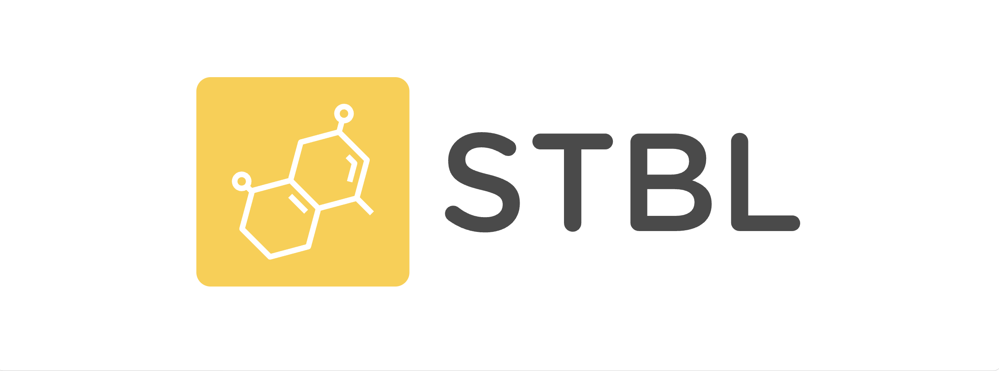

<h1 align="center">STBL Explorer</h1>

基于 Blockscout 开发的 STBL Layer1 区块链浏览器

---

## 项目简介

STBL Explorer 是基于 Blockscout 开发的区块链浏览器，专为 STBL Layer1 区块链设计。STBL Layer1 是由 STBL Foundation（稳定币基金会）发起的 Web3 项目，致力于打造一个高 TPS、高度去中心化、EVM 兼容的独立 Layer1 公链，作为人民币稳定币的流动层。

## 技术特性

- **基于 Blockscout**：继承了 Blockscout 的强大区块链数据分析与可视化能力。
- **EVM 兼容**：支持以太坊生态的智能合约与工具。
- **高 TPS & 去中心化**：计划募集最多 1000 台服务器作为验证节点，提升网络性能与安全性。
- **原生代币 STBL**：公链原生代币总量 100 亿，可用于支付 gas 费与参与生态激励。
- **稳定币支持**：STBL 公链将作为人民币稳定币的发行与流通基础，确保每一枚稳定币都有真实资产支撑。

## 参与方式

- 欢迎社区成员借用闲置服务器，参与 Layer1 网络建设。根据验证者在线时长，定期发放 STBL 代币奖励。
- 服务器募集表单：[Google 表单链接](https://docs.google.com/forms/d/1yvQ-SRGMuKwI9CKaXtepRbtQYsHS8MqxEf9D8RbcWZI/edit)

## 未来规划

1. 服务器节点去中心化，定期奖励原生代币。
2. 部署独立 Layer1 区块链，承载人民币稳定币。
3. STBL 代币上线 Cetus 交易所，可 1:1 兑换为公链原生代币，兑换后代币永久销毁。
4. 寻找 VC 投资，推动稳定币合规发行，接受机构审计。
5. 推广公链+稳定币支付模式，用户可质押稳定币获得 STBL 代币奖励，实现高于传统支付的收益。

---

## 开发与部署

STBL Explorer 完全开源，继承 Blockscout 的部署与配置方式。详细部署文档请参考 [Blockscout 官方文档](https://docs.blockscout.com/)。

---

## 许可证

本项目基于 GNU GPL v3.0 协议开源。详情见 [LICENSE](LICENSE) 文件